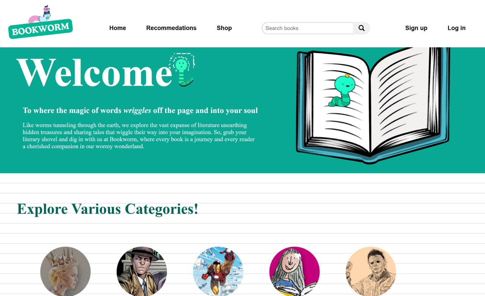
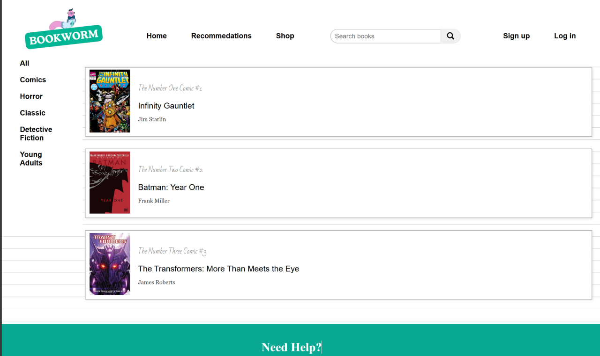
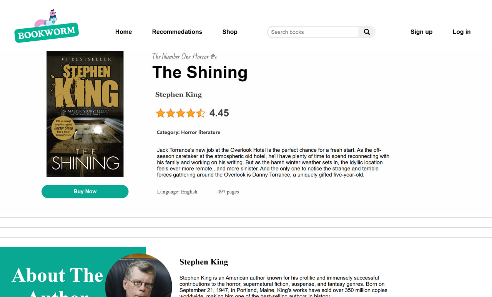
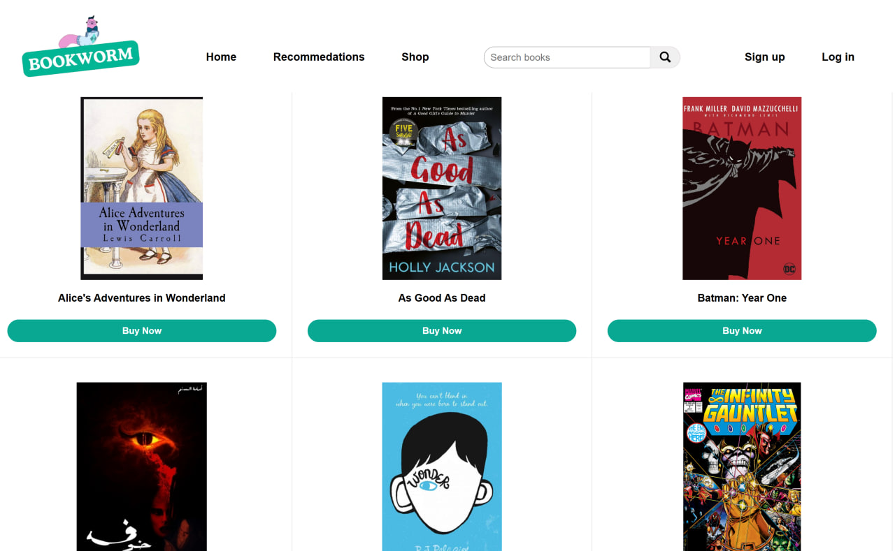

# Bookworm
Web Development Project
# 📚 Bookworm

A simple, responsive web app to browse, view details, and shop for books.

---

## 🌟 Features

- Clean and modern UI
- Home welcome page with call to action
- Browse categories and recommendations
- Detailed book pages with author info
- Shop grid with "Buy Now" buttons
- Fully responsive design

---

## 📸 Screenshots

### 🏠 Home Page

Welcome screen with site introduction and call to action.

---

### 📚 Recommendations Page

Browse by categories with list of recommended books.

---

### 📖 Book Detail Page

Detailed view with book cover, description, author bio, and "Buy Now" button.

---

### 🛒 Shop Page

Grid view of available books with covers and purchase links.

---

